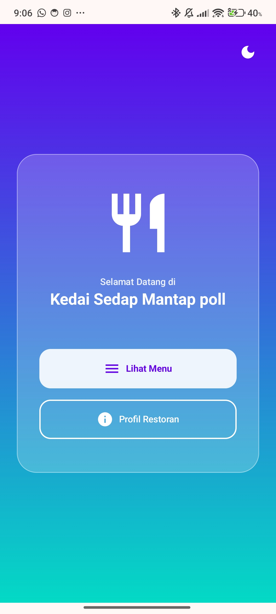
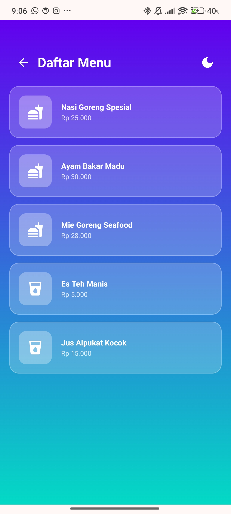
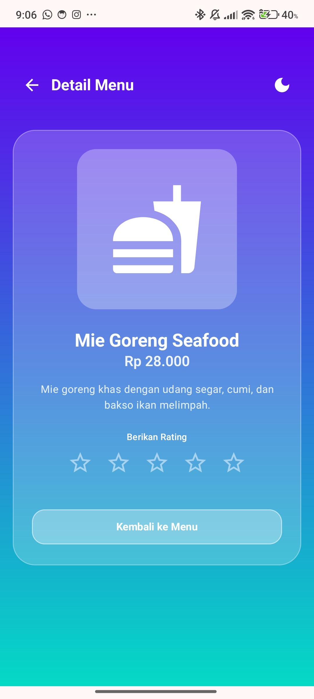
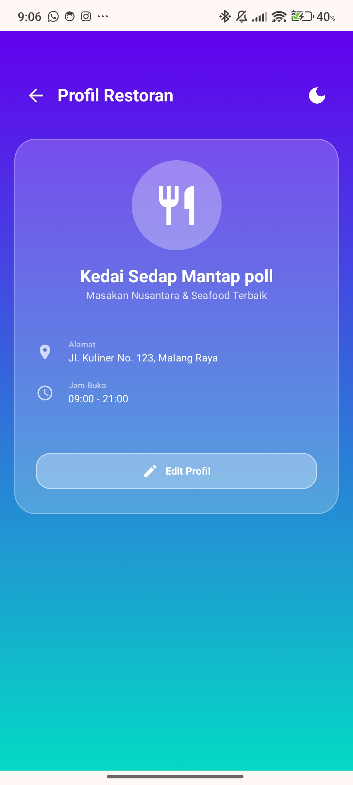
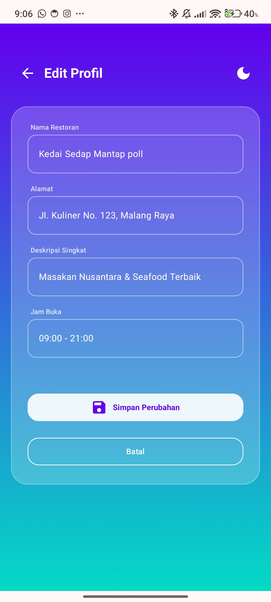

# 🍽️ Kedai Sedap Mantap poll - Restaurant Management App

Aplikasi Manajemen Restoran modern dengan desain **Glassmorphism** yang elegan, dibangun menggunakan **Jetpack Compose**. Aplikasi ini mendukung fitur pengelolaan menu, profil restoran, dan sistem tema dinamis.

## ✨ Fitur Utama

- **Glassmorphism UI**: Antarmuka mewah dengan efek transparansi kaca dan gradien warna cyan-ungu.
- **Dynamic Theme Toggle**: Berpindah antara Mode Terang dan Gelap secara instan dengan ikon di pojok kanan atas.
- **Persistent Theme**: Pilihan tema (Dark/Light) tersimpan otomatis di `SharedPreferences`.
- **Interactive Menu Rating**: Pengguna dapat memberikan rating bintang (1-5) pada detail menu, dan rating tersebut tersimpan secara permanen di `SharedPreferences`.
- **Manajemen Profil**: Mengubah data restoran (Nama, Alamat, Jam Buka) melalui layar Edit Profil dengan fitur Simpan dan Batal.
- **Smooth Navigation**: Transisi antar layar menggunakan animasi *Slide* dan *Fade* yang halus (NavHost).
- **Clean Architecture**: Pemisahan logika navigasi ke dalam folder `ui.navigation`.

## 📸 Screenshots

| Home Screen | Daftar Menu | Detail Menu |
|---|---|---|
|  |  |  |

| Profil Restoran | Edit Profil |
|---|---|
|  |  |

## 🛠️ Teknologi

- **Language**: Kotlin
- **UI Framework**: Jetpack Compose
- **Navigation**: Jetpack Navigation Component
- **Persistence**: SharedPreferences
- **Theme**: Material Design 3 (Glassmorphism Custom)

## 📂 Struktur Proyek

- `ui.navigation`: Konfigurasi `NavGraph` dan animasi transisi.
- `ui.screens`: Implementasi UI (Home, Menu, Detail, Profile, Edit).
- `ui.theme`: Pengaturan tema dan warna Glassmorphism.

---
*Dikerjakan untuk tugas UTS Pemrograman Mobile.*
